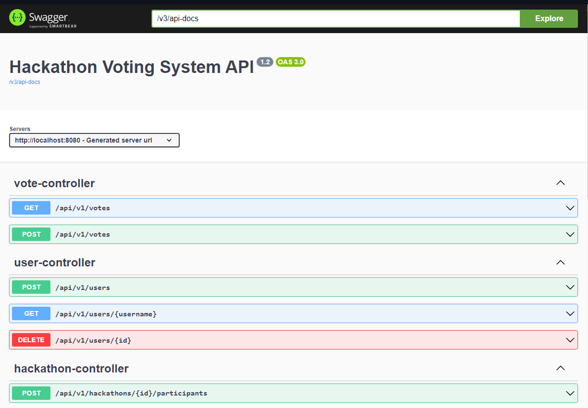

# Hackathon Voting System - Backend API v1.2

This backend service serves as the infrastructure for a hackathon voting system.

## Usage
1. Clone the project repository: \
   ```git clone https://github.com/gestanestle/hvs-backend.git```

3. Navigate to the root directory: \
   ```cd hvs-backend```

5. Run the containers: \
   ```docker compose up -d```

You can check if the service is up and running by querying the actuator endpoint: \
```http://localhost:8080/actuator/health```

The database in use is PostgreSQL 15-alpine. The Application Runner populates the database with initial data upon startup, including Hackathon Season 1 with pre-populated participants and initialization for Hackathon Season 2 with empty participants. Seed data can be queried at  ```http://localhost:8080/api/v1/hackathons```.

## API Documentation

Detailed API documentation is available at ```http://localhost:8080/swagger-ui.html```. 



Explore the available endpoints and understand how to interact with the backend.


